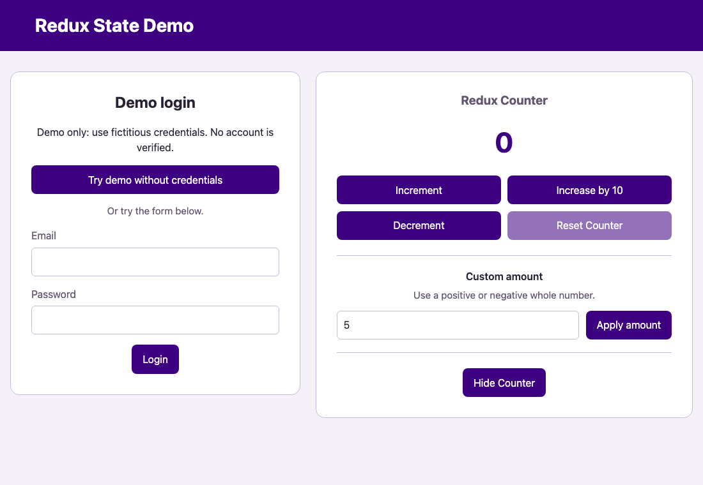

# React Redux State Demo

[](https://react.dev/)
[](https://redux.js.org/)
[](https://github.com/fatmakahveci/react-ts-redux/actions/workflows/ci.yml)
[](https://github.com/fatmakahveci/react-ts-redux/commits/main)
[](LICENSE.md)

A compact Next.js and TypeScript project demonstrating centralized client state with Redux Toolkit and React Redux.

## Demo



Sign in with demo values, adjust the counter, toggle its visibility, and sign out.
The counter value is preserved through login and logout.

## Highlights

- Redux Toolkit slices for authentication and counter state
- Typed store access from React components
- Provider-based integration with the Next.js client application
- Small, focused components for authentication, profile, header, and counter flows

## Technology

- Next.js
- React
- TypeScript
- Redux Toolkit
- React Redux

TypeScript is pinned to the compatible 6.x compiler API used by Next.js, the
ESLint TypeScript parser, and the test loader. ESLint remains on 9.x because
`eslint-plugin-react` does not yet declare support for ESLint 10. Node.js types
match the project's Node.js 22 runtime.

## Getting Started

### Prerequisites

- Node.js 22.23.3 (pinned in `.nvmrc`; CI and Docker use the same version)
- Supported runtime ranges: `^22.22.2 || ^24.15.0 || >=26.0.0`
- npm

### Installation

```bash
nvm install
nvm use
npm ci
npm run dev
```

If you do not use nvm, install a supported Node.js version before running npm.

Open http://localhost:3000.

Authentication is a client-side state demo: any non-empty password and valid email format switch the UI to the profile. No credentials are verified or stored, and refreshing resets the state.

## Quality Checks

```bash
npm test
npm run lint
npm run build
npm run audit:security
```

`npm test` runs the Node.js test suite. Reducer tests check state transitions,
numeric edge cases, and immutability. Integration tests exercise the real Redux
store and React components, including form submission and button clicks in jsdom.

| Test file | Coverage |
| --- | --- |
| `tests/reducers.test.mjs` | Initial state, login/logout, counter arithmetic, visibility, immutable updates, and unrelated actions |
| `tests/store.test.mjs` | Independent store instances and isolation between authentication and counter state |
| `tests/state-rendering.test.mjs` | Server-rendered views, credential serialization protection, Redux provider integration, and skip-link destination |
| `tests/user-interactions.test.mjs` | Invalid forms, submission, logout, accessible controls, counter actions, rerenders, and fresh mounts |

Run a single suite with, for example, `node --test tests/reducers.test.mjs`.
DOM tests do not replace visual browser checks or verify Next.js navigation.

## CI/CD

GitHub Actions runs dependency auditing, lint, tests, a production build, and a Docker smoke test
for pull requests and pushes to `main`. Publishing a release runs the same
checks before delivering the application image and source package to GHCR.

See the [CI/CD guide](docs/ci-cd.md) for setup, image tags, local Docker usage,
and rollback instructions.

Security protections and reporting instructions are described in the
[security policy](.github/SECURITY.md).

## Repository Structure

```text
src/
├── app/                         # Next.js routes, root layout, and global styles
│   ├── globals.css
│   ├── layout.tsx
│   └── page.tsx
├── components/
│   ├── app-header/              # Header component and styles
│   ├── counter/                 # Counter component and styles
│   ├── login-form/              # Login form component and styles
│   ├── user-profile/            # Profile component
│   └── state-demo.tsx           # Demo composition
└── store/
    ├── slices/
    │   ├── auth-slice.ts
    │   └── counter-slice.ts
    ├── redux-hooks.ts
    └── store.ts
tests/
├── helpers/register-typescript.mjs
├── reducers.test.mjs
├── state-rendering.test.mjs
├── store.test.mjs
└── user-interactions.test.mjs
docs/
└── assets/redux-state-demo.gif
```

Source files and directories use `kebab-case`; React component names use
`PascalCase` (for example, `login-form.tsx` exports `LoginForm`). Component-specific styles
share the component filename; shared panel styles live in `src/app/globals.css`.
Each Redux slice owns its state type and initial values. Next.js route files follow the framework's naming
conventions. Indentation and whitespace settings are defined in `.editorconfig`.

## Project Resources

- [Changelog](CHANGELOG.md)
- [Contributing guide](.github/CONTRIBUTING.md)
- [Security policy](.github/SECURITY.md)
- [License](LICENSE.md)
